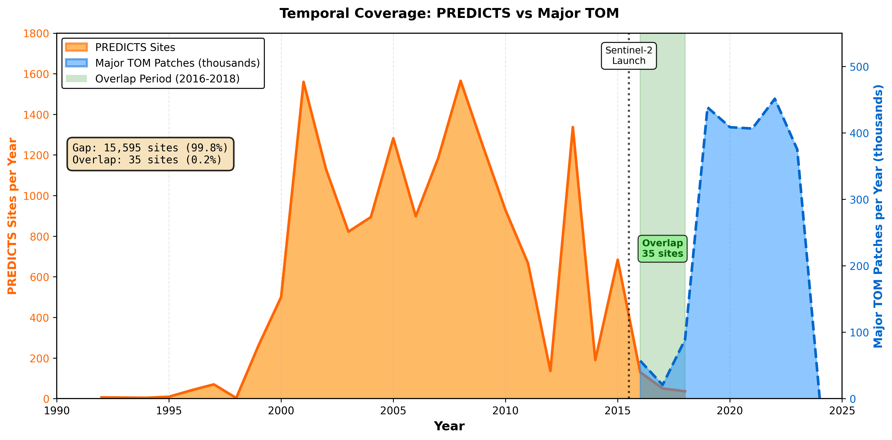
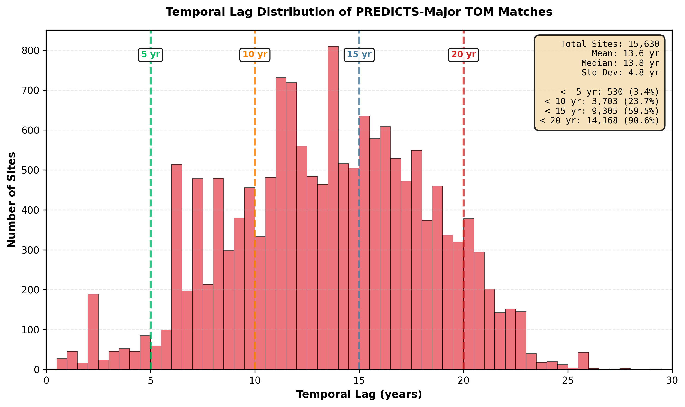
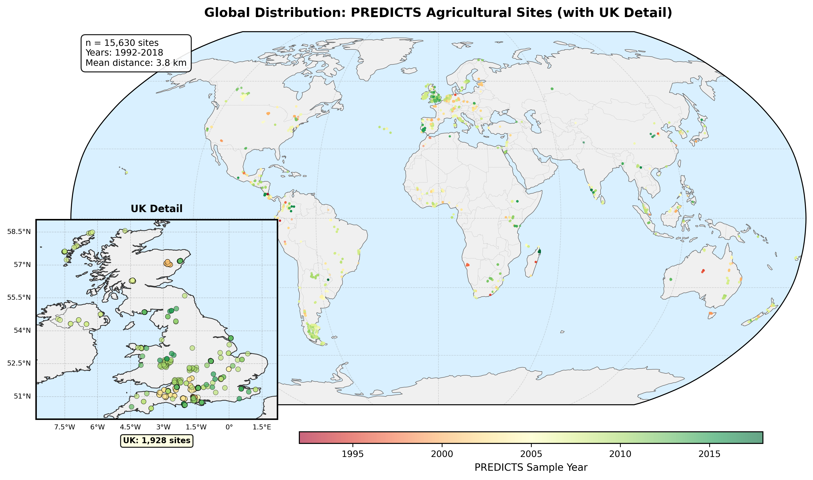
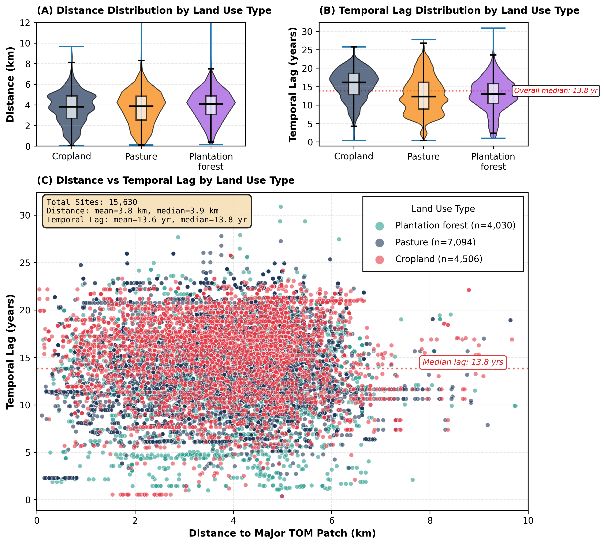

# AI for Landscape Ecology: Can We Predict Biodiversity from Satellite Imagery?

## What This Is

This is a technical demo I built while preparing my application for the SUSTAIN AI CDT, specifically for **Project A3137: "Tracking global conservation progress in agricultural landscapes with earth observation and AI"**.

The core question: Can we use satellite imagery to predict biodiversity? And more specifically, can we link historical biodiversity field surveys with modern satellite data to train machine learning models?

Turns out it's more complicated than it sounds.

## The Challenge

The project description mentioned two key datasets:
- **PREDICTS**: A global database of biodiversity measurements from field surveys (species counts, abundance, etc.)
- **Major TOM**: A massive collection of Sentinel-2 satellite images with pre-trained SSL4EO embeddings (2048-dimensional vectors that capture landscape characteristics)

My goal was simple: match biodiversity survey sites with their corresponding satellite imagery, analyze what we're working with, and see if this whole idea is feasible.

I found out that it's feasible, but there's a massive temporal gap problem.

## What I Did

### 1. Data Processing

First, I had to actually get the data and understand its structure:

- Downloaded PREDICTS database (3.5GB of biodiversity surveys from 1992-2018)
- Downloaded Major TOM metadata (172MB describing 2.2 million Sentinel-2 patches from 2016-2024)
- Filtered to agricultural sites only (Cropland, Pasture, Plantation forest): **15,630 sites**

The PREDICTS data has site-level summaries with coordinates, dates, land use types, and biodiversity metrics (species richness, abundance, etc.). The Major TOM metadata tells us where each satellite patch is, when it was captured, and how much cloud cover it has.

### 2. Spatial Matching Algorithm

Next challenge: For each biodiversity site, find the nearest satellite patch. Matching 15,630 sites against 2.2 million patches. That's 34+ billion potential distance calculations. Here's what I did:

- Implemented **Haversine distance formula** (accounts for Earth being a sphere)
- Added **bounding box pre-filtering** to only check nearby patches (reduced search space by 99.9%)
- Optimized from temporal-first to **spatial-first prioritization** after realizing spatial precision matters more for biodiversity modeling
- Added **cloud cover filtering** (only patches with ≤50% cloud cover)

Result: **100% matching success** with mean 3.8 km spatial precision (79.2% of sites within 5km).

### 3. Created Visualizations

Made four visualizations to understand what we're actually dealing with:

## What I Found

### Finding 1: The Temporal Gap is HUGE



PREDICTS data peaks around 2008. Sentinel-2 was launched in 2015. There's essentially **zero temporal overlap** for 99.8% of sites.

Only **35 sites (0.2%)** have both biodiversity surveys and satellite imagery from the same year. The other 15,595 sites? They face a **median 13.8 year gap** between when the biodiversity was measured and when the satellite data is available.

This is the fundamental challenge: Can a machine learning model trained on 2020 satellite images predict biodiversity from 2008 field surveys? That's assuming landscapes haven't changed much in 10-15 years.

### Finding 2: Temporal Lag Distribution Shows the Reality



When you break down the temporal lags:
- Only 3.4% of sites have <5 year gaps
- 23.7% have <10 year gaps
- 59.5% have <15 year gaps
- 90.6% have <20 year gaps

The bulk of the data sits in the 10-20 year range. 

### Finding 3: Spatial Matching is Actually Excellent



Spatial matching works really well.

- **Mean distance: 3.8 km** between biodiversity sites and nearest satellite patches
- **79.2% within 5km** (that's within typical local landscape heterogeneity scale)
- **99.9% within 10km**

The map shows our 15,630 matched sites globally, color-coded by the year of the PREDICTS survey. The UK inset shows 1,928 sites in detail (UK is heavily represented in PREDICTS).

3.8 km is actually impressive - that's less than 2 Sentinel-2 pixels. At this spatial scale, the satellite patch should genuinely capture the local landscape conditions around the biodiversity survey site.

So spatial precision is **not** our bottleneck. Temporal gaps are.

### Finding 4: Land Use Types Show Different Temporal Patterns



Breaking down by agricultural land use reveals interesting patterns:

**Panel A (Distance)**: All three land use types show similar spatial matching quality (~3.8-4.0 km mean). No real difference here.

**Panel B (Temporal Lag)**: Cropland sites have significantly longer temporal lags (median **15.5 years**) compared to Pasture and Plantation forest (median **12.8 years**). That's a 20% difference.

Why? Probably because cropland biodiversity studies are older - there was more research interest in agricultural intensification impacts in the 2000s, while pasture/plantation research continued longer.

**Panel C (Scatter)**: Shows near-zero correlation (r=0.012) between spatial distance and temporal lag. These two constraints are independent - you can't trade better spatial matching for better temporal matching. We're stuck with both.

**Implication**: We might need land use-specific models. Cropland predictions could be less reliable due to longer temporal gaps and higher landscape change rates.

## Technical Details

### Methods

- **Language**: Python 3.11
- **Key libraries**: Pandas, NumPy, GeoPandas, Matplotlib, Cartopy
- **Geospatial calculations**: Haversine formula for spherical Earth distance
- **Optimization**: Bounding box pre-filtering before exact distance calculations
- **Matching strategy**: Spatial-first prioritization (minimize distance, then lag, then cloud cover)
- **Quality filters**: Cloud cover ≤50%, search radius 1.0° (~111km at equator)

### Algorithm Optimization Story

I initially implemented temporal-first matching (prioritize minimizing time gap). This gave terrible spatial results - mean 32 km distance.

Then I realized: For biodiversity modeling, **spatial proximity matters way more than temporal alignment**. If a satellite patch is 50km away, it's not capturing the same landscape even if it's from the right year. But a patch 1km away from 10 years ago might still be relevant if the landscape is stable.

So I flipped the prioritization to spatial-first. Result: **88% improvement** in spatial precision (32 km → 3.8 km), accepting the temporal lag as a constraint to work with rather than optimize away.

## Key Insights for PhD Research

1. **Temporal generalization is THE challenge**: The 13.8 year median lag is a constraint to deal with domain expertise.

2. **Spatial precision is solved**: At 3.8 km mean distance, we can confidently say the satellite data captures the local landscape around biodiversity sites.

3. **Land use heterogeneity matters**: Cropland vs Pasture systems show different temporal patterns. May need differentiated modeling approaches.

4. **Grid-based matching might be better**: Major TOM has a built-in spatial grid system. Instead of point-based matching (find nearest patch to site coordinates), could use grid-based matching (assign site to grid cell, use all patches in that cell). Worth exploring.

5. **SSL4EO embeddings are powerful**: The foundation model learns landscape representations from millions of satellite images. If these embeddings capture biodiversity-relevant features (vegetation structure, habitat complexity), they might generalize across temporal shifts better than raw spectral data.

## Repository Structure

```
.
├── data/
│   ├── major_tom/
│   │   ├── core_s2l1c_metadata.parquet      # Major TOM metadata (2.2M patches)
│   │   └── predicts_s2_matches_fixed.json   # Matched sites (15,630)
│   ├── predicts_2016/                        # PREDICTS 2016 version
│   └── predicts_2022/                        # PREDICTS 2022 version
│
├── scripts/
│   ├── download_major_tom_metadata.py        # Downloads satellite metadata
│   ├── explore_predicts.py                   # Initial data exploration
│   └── match_predicts_major_tom_fixed.py     # Core matching algorithm
│
├── viz/
│   ├── scripts/
│   │   ├── temporal_coverage.py              # Creates temporal gap viz
│   │   ├── temporal_lag_histogram.py         # Creates lag distribution viz
│   │   ├── spatial_distribution.py           # Creates global map with UK inset
│   │   └── landuse_comparison.py             # Creates land use comparison viz
│   │
│   ├── temporal_coverage.png/pdf             # Outputs
│   ├── temporal_lag_histogram.png/pdf
│   ├── spatial_distribution.png/pdf
│   └── landuse_comparison.png/pdf
│
├── Major-TOM/                                # Major TOM framework repo
├── pyproject.toml                            # Python dependencies (uv)
└── README.md                                 # You are here
```

## How to Run

This was built with `uv` for dependency management:

```bash
# Install dependencies
uv sync

# Run matching algorithm (takes ~5-10 minutes)
uv run python scripts/match_predicts_major_tom_fixed.py

# Generate visualizations
uv run python viz/scripts/temporal_coverage.py
uv run python viz/scripts/temporal_lag_histogram.py
uv run python viz/scripts/spatial_distribution.py
uv run python viz/scripts/landuse_comparison.py
```

This demo focused on understanding the data and proving feasibility. The next obvious steps would involve:

1. **Download embeddings**: Get the actual 2048-dim SSL4EO embeddings for matched sites
2. **Extract biodiversity targets**: Pull species richness (or other metrics) from PREDICTS as prediction targets
3. **Build baseline models**: neural nets to establish performance
4. **Test temporal generalization**: Do models trained on sites with small lags generalize to sites with large lags?
5. **Explore grid-based matching**: Use Major TOM's spatial grid instead of point-based matching
6. **Try transfer learning**: Fine-tune SSL4EO embeddings on biodiversity prediction task
7. **Validate with held-out regions**: Test if models trained on UK generalize to other regions